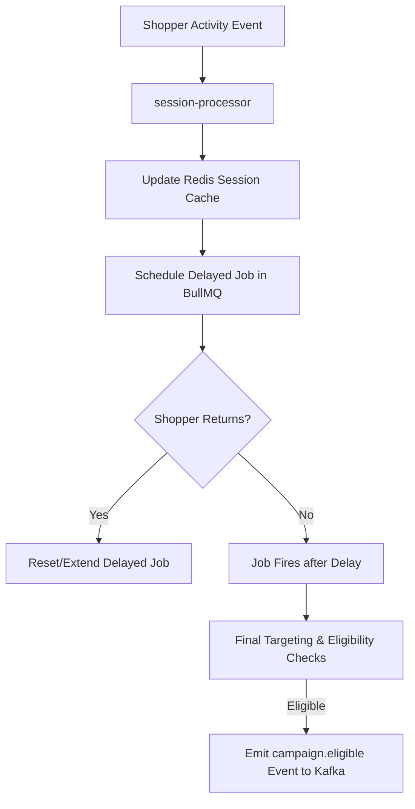

# Inactivity & Campaign Engine Architecture

## Overview
The Inactivity & Campaign Engine detects high-intent shopper inactivity (browse abandonment) and evaluates eligibility for recovery campaigns. The system utilizes Redis-backed BullMQ delayed queues to schedule evaluate jobs and verify state lazily when a job fires.

---

## Technical Details

### 1. BullMQ Scheduling & Job Options
* **Queue Name**: `inactivity-evaluation-queue`
* **Custom Job ID**: `inactivity_${tenantId}_${sessionId}_${campaignId}`
* **Failed-Job Retention Strategy**:
  * `removeOnComplete`: `true` (Completed jobs are automatically pruned to prevent Redis memory footprint expansion).
  * `removeOnFail`: `{ age: 86400, count: 1000 }` (Failed jobs are preserved for debugging/telemetry up to 24 hours or a maximum count of 1,000, whichever limit is reached first).
* **Retry Strategy**: 3 attempts with exponential backoff (`delay: 5000` ms).

### 2. Final Inactivity & Target Eligibility Checks
When a job fires, the background worker performs the following checks under the tenant's transaction-isolated context (`withStoreContext`):
1. **Delayed Verification Check (Stale Check)**: Reads `last_event_timestamp` from Redis. If the difference `Date.now() - last_event_timestamp` is less than `campaign.inactivity_duration_minutes * 60000 - 5000` ms (safety buffer applied), the shopper performed subsequent activity. The job is discarded as stale.
2. **Purchase Suppression Circuit Breaker**: Evaluates if the shopper converted (PostgreSQL is authoritative).
3. **Intent Score Check**: Checks if current intent score $\ge$ campaign minimum requirement.
4. **Consent Check**: Confirms active marketing consent is granted.
5. **Cooldown Audit**: Verifies the shopper has not received this campaign within the cooldown period.
6. **Frequency Caps**: Checks global limits (max 3 messages per 30 days) and campaign-specific caps.
7. **Identity Verification**: Confirms contact identity details exist for the target channel.

### 3. Fail-Safe Closed Behavior
If any critical check (consent, suppression, campaign configuration, cooldown) fails to verify due to transient errors or database dropouts:
* The system **fails closed**: the shopper is marked as *NOT ELIGIBLE*, and no outbound event is published.
* The job is retried by BullMQ.

---

## Infrastructure Assumptions

### 1. Clock Synchronization (NTP)
* **Distributed Clock Assumption**: Inactivity evaluations are time-sensitive and rely on comparing the server's local time (`Date.now()`) with the Redis/Postgres session timestamps (`last_event_timestamp`).
* **Requirement**: Network Time Protocol (NTP) synchronization must be active and monitored across all nodes in the cluster (worker instances, PostgreSQL database host, and Redis instances).
* **Safety Margin**: A **5-second safety buffer** is applied to evaluate time difference calculations. This margin absorbs:
  * Minimal clock drift between synchronized machines (typically <10ms under NTP).
  * BullMQ worker polling latency.
  * Node.js event-loop delays.
* **Warning**: If clock drift between nodes exceeds 5 seconds, the engine may evaluate returning-shopper stale checks incorrectly. NTP monitoring is assumed as an operational requirement of the hosting infrastructure.
