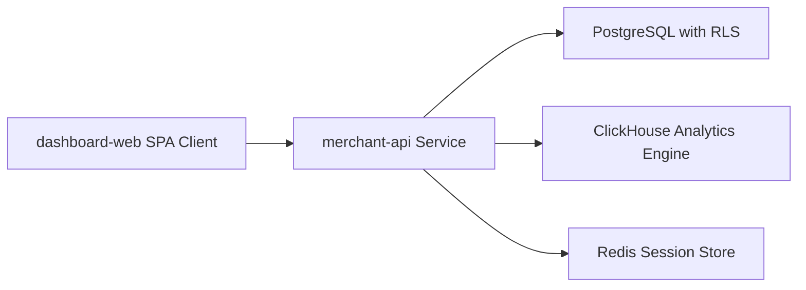

# Merchant Dashboard & Core API Architecture

## Overview
The merchant-facing management tier consists of a Fastify backend REST API (`apps/merchant-api`) and a React SPA web application (`apps/dashboard-web`).



---

## Security Framework

### 1. Session Authentication
* **Token Structure**: JSON Web Token (JWT) signed with the server's `jwtSecret`. Includes `userId` and `email`.
* **Transport Guard**: Stored in a cryptographically signed cookie:
  * `httpOnly: true` (Blocks cross-site scripting/XSS reading).
  * `secure: true` (Forces HTTPS transmission).
  * `sameSite: 'lax'` (Provides defense against CSRF).

### 2. Tenant Isolation & IDOR Verification
Every incoming REST operation undergoes tenant alignment check in the authentication middleware:
1. Decode JWT to resolve `userId`.
2. Retrieve organization memberships and list of accessible store IDs.
3. Match target `storeId` (from headers, query string, or payload).
4. If not in membership list, terminate request immediately with `403 Forbidden`.
5. Wrap the active database query in Knex context:
   `withStoreContext(storeId, async (trx) => { ... })`
   which executes `SET LOCAL app.current_store_id = storeId` on the database connection, securing RLS mapping.

### 3. Role-Based Access Control (RBAC)
* **Owner**: Organization administrative access, API key creation/rotation, integration setup, campaigns.
* **Admin**: Integration setup, API key management, campaign edits, analytics reads.
* **Member**: Campaign list, campaign parameter edits (viewer defaults block).
* **Viewer**: Read-only access to campaign parameters, logs, and analytics.

---

## Key Feature Boundaries

### Campaign CRUD & Validation
* **Archive Safety**: Campaigns are never hard-deleted. Soft-deletion is applied by setting `deleted_at = new Date()`, which excludes them from active listings while preserving historical analytics.
* **Input Validation**: Backend strictly validates numeric limits:
  * Inactivity Duration: $> 0$ minutes.
  * Minimum Intent Score: $\ge 0$ and $\le 100$.
  * Cooldown Period: $\ge 0$ seconds.

### Ingestion API Key Management
* **Prefix Exposure**: Lists return only `key_prefix` (first 8 chars) for UI identification.
* **Security at Rest**: Stored in PostgreSQL as a SHA-256 hash. The raw key is returned **exactly once** upon creation and can never be retrieved subsequently.

### ClickHouse Funnel Analytics
Calculates e-commerce stages asynchronously using high-performance aggregates.
Uses **parameterized queries** to prevent SQL injection (`{storeId:UUID}` ClickHouse parameter syntax):
```sql
SELECT
  uniqExact(shopper_id) as stage_unique_shoppers,
  countIf(event_type = 'page_view') as stage_page_views,
  countIf(event_type = 'product_view') as stage_product_views,
  countIf(event_type = 'cart_add') as stage_cart_adds,
  countIf(event_type = 'purchase') as stage_purchases
FROM events_analytics
WHERE tenant_id = {storeId:UUID}
```
This query ensures O(1) read latency without scanning deep table logs from client memory.
ClickHouse failures gracefully fall back to zero aggregates — merchants always get a valid response.

---

## Audit Logging

All sensitive mutations emit non-blocking records to `audit_logs` via `withAdminContext`:

| Operation | Action Key |
|-----------|-----------|
| Campaign created | `campaign.created` |
| Campaign updated | `campaign.updated` |
| Campaign paused/resumed | `campaign.toggled` |
| Campaign archived | `campaign.archived` |
| API key created | `api_key.created` |
| API key revoked | `api_key.revoked` |
| WhatsApp configured | `whatsapp.configured` |

**Security invariant**: Audit metadata never contains raw API keys, access tokens, or passwords. Only safe identifiers (key prefix, phone number ID) are stored.

Audit logs are scoped to `organization_id` and require `owner` or `admin` role to read.
