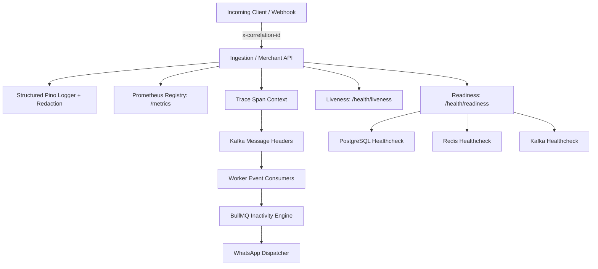

# Production Observability & Security Architecture (Phase 12)

## Overview
Revynta's Observability and Security framework provides production-grade machine-readable structured logging (Pino with automatic PII/secret redaction), end-to-end correlation tracing (`x-correlation-id`), Prometheus `/metrics` metrics export, OpenTelemetry-compatible span tracking, separate `/health/liveness` & `/health/readiness` endpoints, bounded graceful shutdown handling, and standardized error classification.



---

## 1. Structured Logging & Redaction Rules

All logs emitted by Revynta use JSON format in production with automatic redaction of sensitive credentials and PII:

### Redacted Fields
- `password`, `password_hash`, `passwordHash`
- `accessToken`, `accessTokenEncrypted`
- `rawKey`, `key_hash`, `keyHash`
- `appSecret`
- `authorization`, `cookie`, `req.headers.authorization`, `req.headers.cookie`
- `encrypted_value`

---

## 2. Request & Event Correlation

Every operation retains an explicit `correlationId` passed via HTTP headers (`x-correlation-id`) and Kafka message headers:

```
HTTP Request (x-correlation-id: "uuid-123")
  ↓
Ingestion API Producer
  ↓ Kafka Header: x-correlation-id="uuid-123"
Session Processor Consumer
  ↓ Kafka Header: x-correlation-id="uuid-123"
BullMQ Inactivity Job
  ↓ Kafka Header: x-correlation-id="uuid-123"
WhatsApp Dispatcher -> Meta Webhook Callback
```

---

## 3. Metrics Registry (Prometheus `/metrics`)

Key production metrics exposed at `GET /metrics`:

| Metric Name | Type | Description |
|-------------|------|-------------|
| `revynta_http_requests_total` | Counter | Total HTTP requests by method, route, and status |
| `revynta_http_request_duration_seconds` | Histogram | Request latency histogram |
| `revynta_events_ingested_total` | Counter | Ingested tracking events by eventType |
| `revynta_kafka_events_consumed_total` | Counter | Kafka consumer processing throughput |
| `revynta_kafka_dlq_total` | Counter | Events routed to Dead Letter Queue |
| `revynta_redis_cache_hits_total` | Counter | Redis cache hits (recommendations, sessions) |
| `revynta_db_query_duration_seconds` | Histogram | PostgreSQL query latency |
| `revynta_campaign_evaluations_total` | Counter | Inactivity campaign evaluation outcomes |
| `revynta_recommendation_latency_seconds` | Histogram | Recommendation rendering latency |

---

## 4. Health Check Separation

- **`/health/liveness`**: Fast $O(1)$ HTTP check verifying process execution. Does not query external databases.
- **`/health/readiness`**: Verifies active connectivity to PostgreSQL, Redis, and Kafka with a strict 2-second timeout. Returns `200 OK` if ready, `503 Service Unavailable` if dependencies are unreachable.

---

## 5. Graceful Shutdown Protocol

Upon receiving `SIGTERM` or `SIGINT`:
1. Stop accepting new HTTP connections via `fastify.close()`.
2. Drain active worker consumer loops within a 10-second timeout window.
3. Commit uncommitted Kafka offsets only when message handling is finalized.
4. Close BullMQ queues, Redis connection pools, PostgreSQL pools, and ClickHouse clients cleanly.

---

## 6. Error Taxonomy

Standardized internal error classes with clean HTTP status and code mapping:

- `ValidationError` (422 `VALIDATION_ERROR`)
- `UnauthorizedError` (401 `UNAUTHORIZED`)
- `ForbiddenError` (403 `FORBIDDEN`)
- `NotFoundError` (404 `NOT_FOUND`)
- `TenantIsolationError` (403 `TENANT_ISOLATION_VIOLATION`)
- `RateLimitError` (429 `RATE_LIMIT_EXCEEDED`)
- `DependencyError` (503 `DEPENDENCY_UNAVAILABLE`)
- `IdempotencyError` (409 `DUPLICATE_EVENT`)
