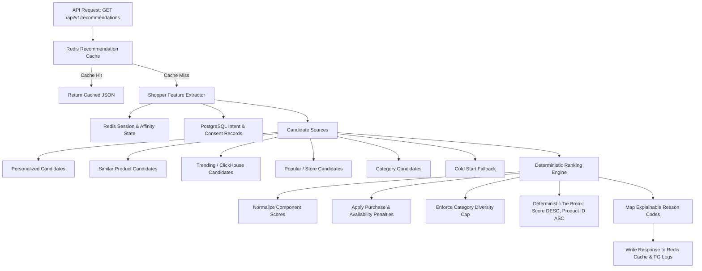

# Recommendation Engine Architecture (Phase 11)

## Overview
Revynta's Recommendation Engine provides production-grade, multi-tenant, explainable, deterministic product recommendations. It leverages behavioral signals across PostgreSQL, Redis, ClickHouse, Phase 7 Intent Scoring, and Phase 5 Consent Architecture to generate personalized recommendations, while gracefully degrading to cold-start strategies for new or anonymous shoppers with zero history.



---

## 1. Hybrid Ranking Formula

The ranking engine combines multiple component signals and subtracts penalty factors:

$$\text{FinalScore} = w_{\text{pers}} \cdot S_{\text{pers}} + w_{\text{aff}} \cdot S_{\text{aff}} + w_{\text{intent}} \cdot S_{\text{intent}} + w_{\text{pop}} \cdot S_{\text{pop}} + w_{\text{trend}} \cdot S_{\text{trend}} + w_{\text{sim}} \cdot S_{\text{sim}} + w_{\text{cat}} \cdot S_{\text{cat}} + w_{\text{fresh}} \cdot S_{\text{fresh}} - P_{\text{purchased}} - P_{\text{unavailable}} - P_{\text{repetition}}$$

### Component Weights & Penalties Configuration
- `personalized`: $0.25$
- `affinity`: $0.20$
- `intent`: $0.15$
- `popularity`: $0.10$
- `trend`: $0.15$
- `similarity`: $0.10$
- `category`: $0.05$
- `freshness`: $0.05$
- `purchasedPenalty`: $1.0$ (Suppresses purchased items via Phase 7 circuit breaker)
- `unavailablePenalty`: $1.0$ (Suppresses out_of_stock or inactive items)
- `repetitionPenalty`: $0.30$ (Penalizes recently viewed products to ensure novelty)

---

## 2. Recommendation Strategies

| Strategy | Description | Candidate Sources | Primary Reason Code |
|----------|-------------|-------------------|---------------------|
| `personalized` | Tailored to shopper's explicit product & category affinities | Personalized, Category | `PERSONALIZED_AFFINITY` |
| `similar` | Given target product X, returns similar items | SimilarProduct (Co-occurrence + Metadata) | `SIMILAR_PRODUCT` |
| `trending` | Recency-weighted trending products from ClickHouse | Trending (ClickHouse log decay) | `TRENDING_STORE` |
| `popular` | Store-level high activity products | Popular (ClickHouse / Postgres) | `POPULAR_STORE` |
| `category` | Products matching requested or affinity category | Category | `CATEGORY_AFFINITY` |
| `cold_start` | Fallback for shoppers with zero history | ColdStart (Freshness + Popularity) | `COLD_START` |
| `hybrid` | Default multi-source merged & ranked recommendations | All candidate sources | Dynamic based on top score |

---

## 3. Explainable Reason Codes

Recommendations return stable machine-readable `reasonCode` and human-friendly `reason` strings:

- `PERSONALIZED_AFFINITY`: "Recommended based on your shopping preferences"
- `SIMILAR_PRODUCT`: "Similar to products you have interacted with"
- `CATEGORY_AFFINITY`: "Popular in {Category}"
- `TRENDING_STORE`: "Trending in this store"
- `POPULAR_STORE`: "Popular in this store"
- `COLD_START`: "Top choice in this store"

---

## 4. Multi-Tenant Security Invariants

1. **PostgreSQL RLS**: All catalog queries run inside `withStoreContext(storeId, ...)` setting `app.current_store_id`. Store A cannot read or return Store B products.
2. **Redis Cache Keys**: Cache keys are tenant-isolated: `recommendations:{storeId}:{entityType}:{entityId}:{strategy}:{version}`.
3. **ClickHouse Queries**: All behavioral queries use parameterized `{tenantId:UUID}` filters.
4. **Consent Guard**: If a shopper's `ConsentState.personalization` is `denied`, affinity signals are stripped to enforce privacy.

---

## 5. Offline Evaluation Metrics

The engine includes `RecommendationEvaluator` to measure offline accuracy and diversity:
- **Precision@K**: Proportion of recommended items that were relevant.
- **Recall@K**: Proportion of relevant items that were recommended.
- **HitRate@K**: Binary indicator of whether at least 1 relevant item was recommended in top K.
- **Coverage**: Proportion of total store catalog recommended across requests.
- **DiversityIndex**: Normalized entropy across category distributions in recommendations.

---

## 6. Future ML Evolution Path

The `RecommendationModel` interface enables seamless future upgrades:
```
Hybrid Heuristic Model (v1)
        ↓
Collaborative Filtering / Co-Occurrence Matrix
        ↓
Embedding-based Vector Retrieval
        ↓
Learning-to-Rank (LambdaMART / GBDT)
        ↓
Deep Neural Recommendation Models
```
Because the candidate generation, deterministic ranking interface, Redis caching, merchant API contracts, and evaluation metrics are completely decoupled from model internals, future models can be introduced without breaking existing client integrations.
