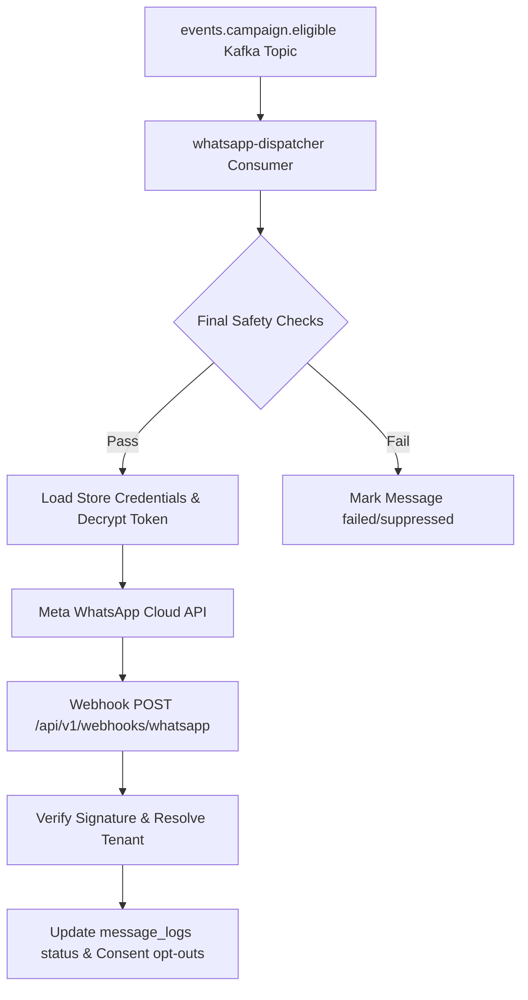

# WhatsApp Integration Architecture

## Overview
The WhatsApp Integration layer consumes campaign eligibility events, performs final checks, dispatches template messages to Meta's WhatsApp Cloud API, and processes inbound webhooks.

---

## Technical Features

### 1. Provider Abstraction
To isolate Meta-specific API models, all message requests pass through the `WhatsAppProvider` abstraction:
- **`MetaWhatsAppProvider`**: Concrete implementation utilizing `AbortSignal.timeout` and strict JSON error parsing.
- **`MockWhatsAppProvider`**: Controlled mock supporting latency simulation and configurable error injections.

### 2. Final Safety Checks
Before calling Meta's API, the consumer performs 10 essential safety audits:
1. Is the campaign still active (`status = 'active'`)?
2. Is the store still enabled?
3. Is WhatsApp integration status `'active'`?
4. Does shopper marketing consent still exist?
5. Has the shopper purchased since eligibility (suppression circuit breaker check)?
6. Has the campaign cooldown been violated (excluding current messageLogId)?
7. Has the global frequency cap been reached (max 3 messages in 30 days, excluding current messageLogId)?
8. Is the recipient phone identity valid?
9. Is the template configuration active?
10. Are the integration credentials valid?

### 3. Webhook Authentication & Security
- **GET Verification**: Authenticates verification requests using a configurable `verifyToken`.
- **POST Authenticity**: Validates requests by generating `HMAC-SHA256` of the raw request payload using the decrypted `appSecret` and compares it with the `x-hub-signature-256` header.
- **Tenant Isolation**: Bypasses RLS only for matching `phoneNumberId` lookup via admin context, then enforces RLS contexts (`withStoreContext`) for all log updates and opt-out processing.

### 4. Retry & Error Classification
- **Transient Failures (429, 500, timeouts)**: Re-thrown to trigger exponential consumer backoff retries.
- **Permanent Failures (400, invalid templates)**: Logged as `'failed'` and committed to prevent infinite retries.
